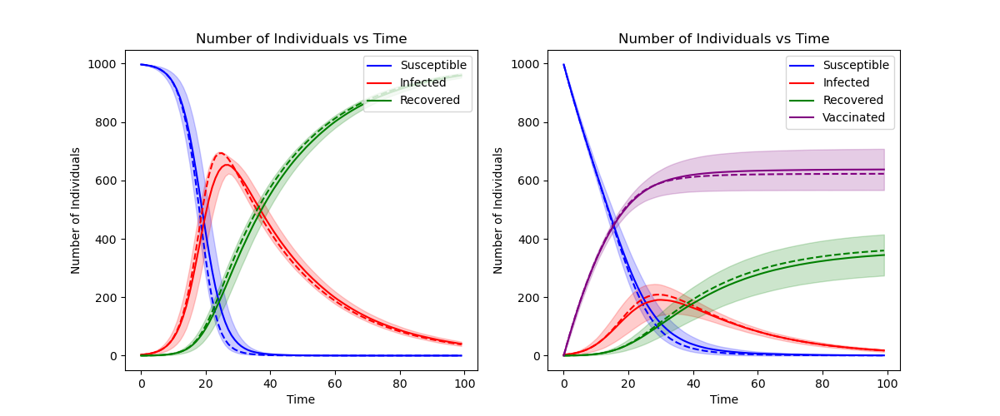

# Contents

- [Contents](#contents)
- [Introduction](#introduction)
  - [Generation](#generation)
  - [Analysis](#analysis)
- [Results](#results)
  - [Fully-Mixed + Global Vaccination](#fully-mixed--global-vaccination)

# Introduction
This project was built for my Part III Individual Project at the University of Southampton. The project is on *How Vaccine Distribution Effects Transmission of a Virus*, with the practical aspect of it being based around comparing different immunization techniques, in conjunction with different underlying networks, to minimise the spread of an epidemic.

The project is split into two key parts, the generation of the data and the analysis of the data.

## Generation
The data is generated in a Maven project so that it utilises the speed benefits of Java. It will output 4 files in the data folder:
- `mathematical_model.csv` Stochastic framework **without** vaccination
- `mathematical_vac.csv` Stochastic framework **with** vaccination
- `stochastic_model.csv` Mathematical framework **without** vaccination
- `stochastic_vac_model.csv` Mathematical framework **with** vaccination

There are 2 key parts in `Main.java` which will change the output data. The first is the underlying network type, which governs the structure of the connection of individuals, and the second being the immunization strategy performed.

## Analysis
Analysis of the data is done in python, due to the ease and simplicity of visualising the data. Currently, the script will output 2 graphs, one for comparing the model without vaccination, and the other being with vaccination.

# Results
Below are the results with the program has outputted, along with the type of immunization strategy and underlying network type:

## Fully-Mixed + Global Vaccination
